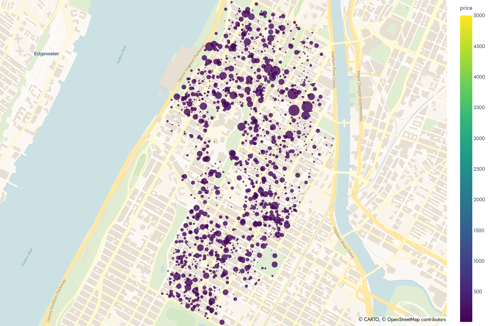

# Abstract

This folder contains a python script that can be run to generate an interactive map displaying Airbnb listings in New York City. 

The programme prompts users to choose the borough and neighbourhood in these boroughs for filtering. In addition to this, the user is prompted to select a numeric variable to be mapped to the size and colour paramter of the scatterplot.

# Example Plot

An exemplar plot, displaying Airbnb listings in Harlem where price is mapped to 'reviews per month' and size is mapped to 'price' is shown and accessible [here](https://jmrze-github.io/Data-Analysis/exemplar_plot.html)

