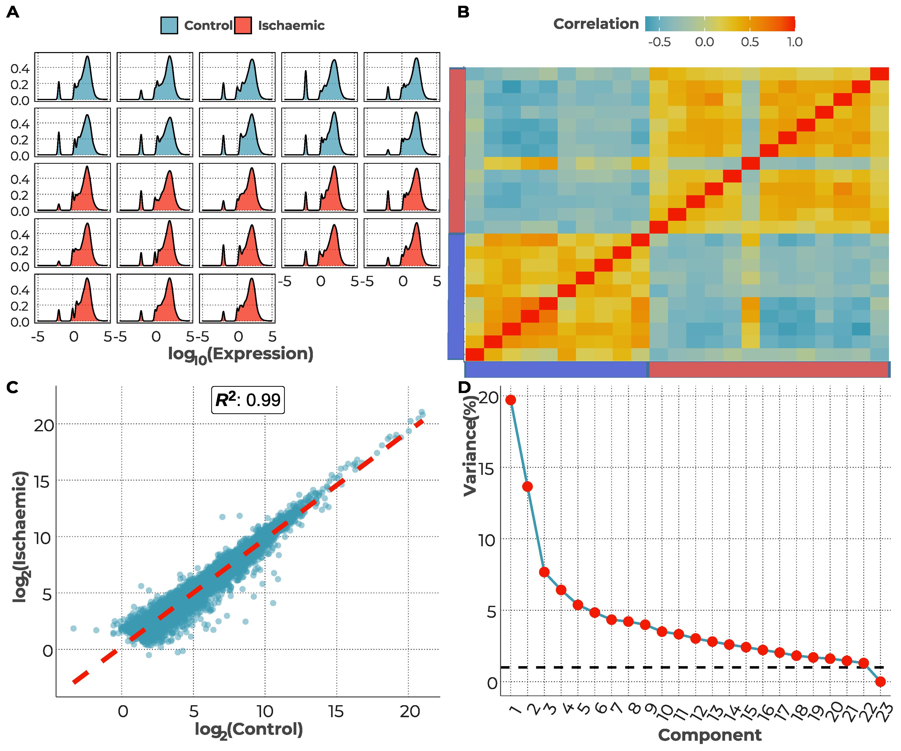
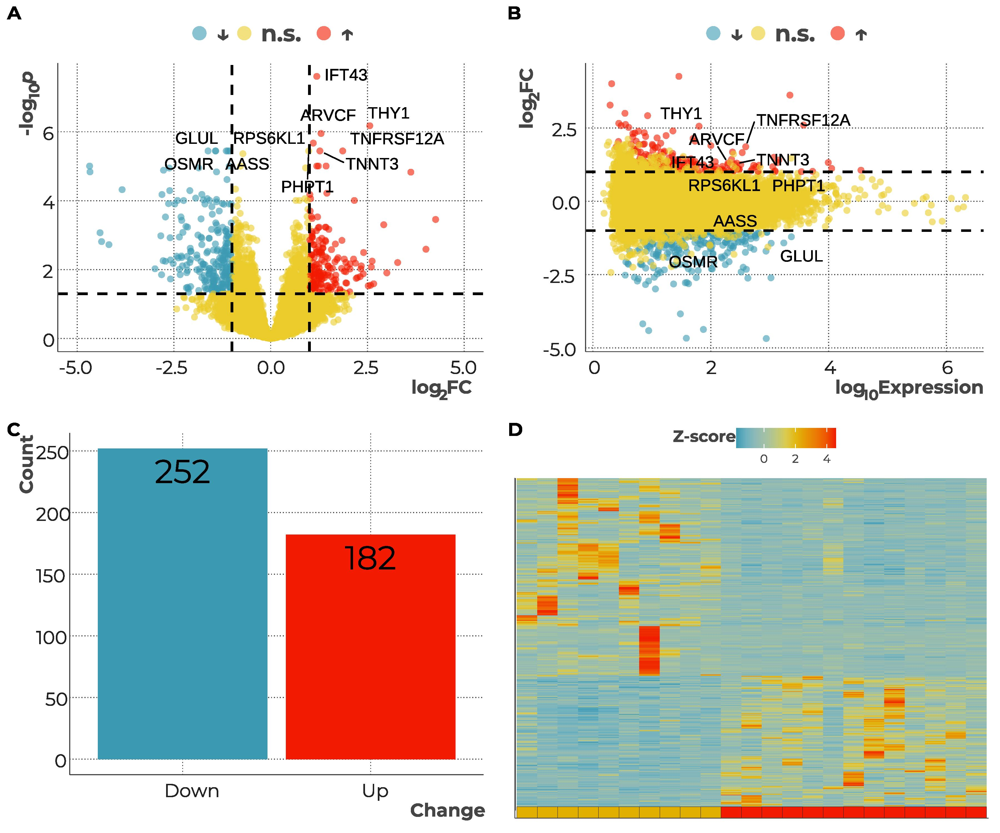
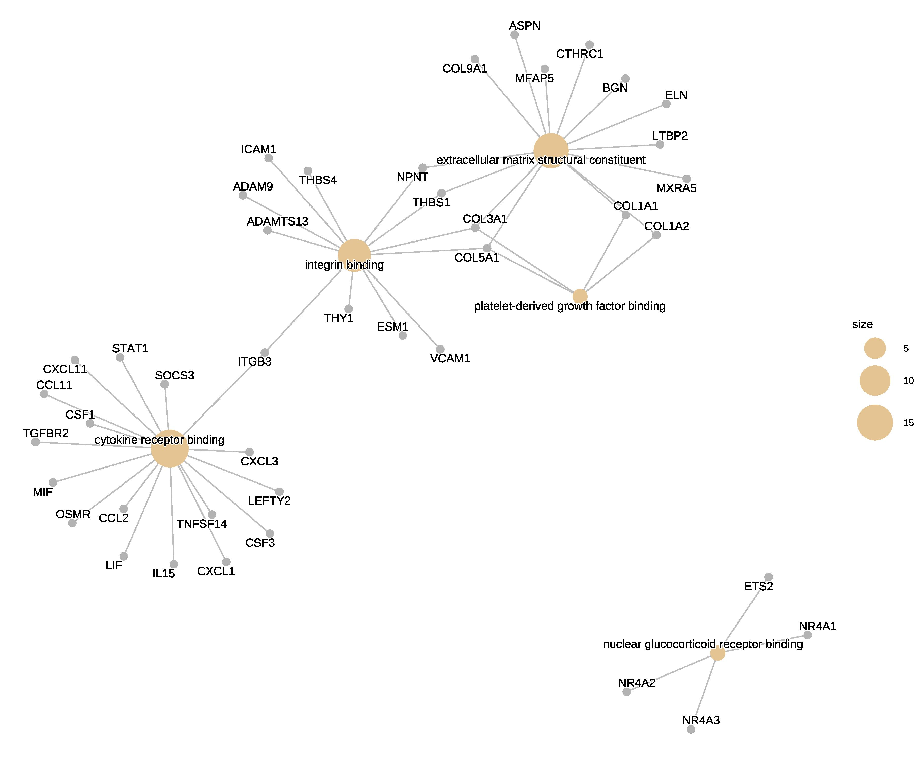
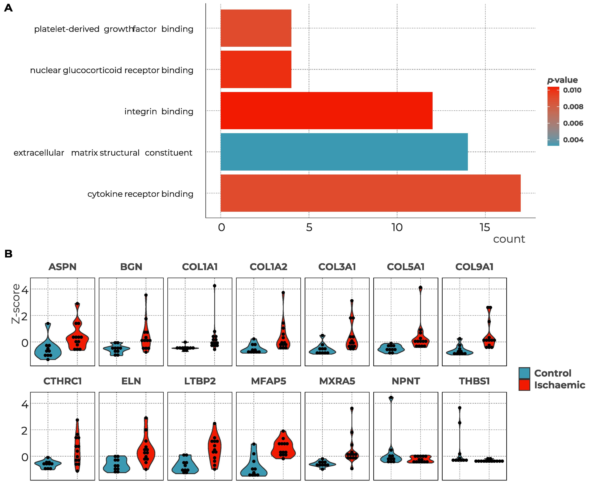

# Description

This folder includes analyses of a sample RNA sequencing dataset provided by the the University of Glasgow Omics Facility.

The datasets includes read-count data from derived from primary cardiac fibroblasts in 10 healthy individuals (control) and 13 individuals who have ischaemic heart disease.

# Figures

## Figure 1

## Figure 2

## Figure 3

## Figure 4

# Files

## Reporting
* 2421232_Report.pdf = Writeup presenting the results and analysis of the RNA-seq datasets
* 2421232_code.md = R markdown code used in analyses
* 2421232_figures.pdf = Figures included in the report (see report for figure legends)

## Datasets
4 CSV (tab-delimited) files included in RNA-seq analysis

### annotations.csv
csv file - 5 columns:
* ID = Ensemble Gene ID
* symbol = Gene symbol
* chromosome
* start = chromosomal transcription start site
* end = chromosomal transcription end site

### DE_control_vs_ischaemic
csv file - 4 columns:
* ID = Ensemble Gene ID
* log2fold = log2(fold change) between control and ischaemic samples
* p = associated p-value
* p.adj = adjusted p-value

### EM.csv
csv file - 24 columns:
* ID = Ensemble Gene ID
* CNT_1:CNT_10 = Read count for control sample (10 replicates)
* ICM_1:ICM_13 = Read count for ischaemic sample (13 replicates) 

### sample_sheet.csv
csv file = 2 columns:
* Sample = Sample Number
* Sample group = Ischaemic or Control sample
