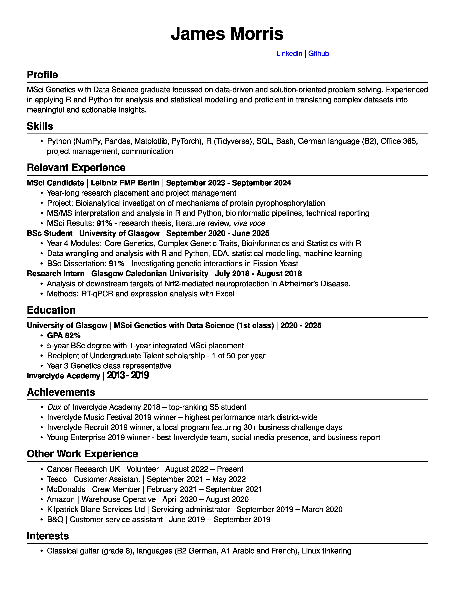

# Data-Analysis
Welcome to my portfolio. I am James, I hold an MSci in Genetics with Data Science from the University of Glasgow and this portfolio is a showcase of example data analyses and visualisations that I have conducted. 

I have particularly focused on work conducted in R, which formed a significant part of my degree work, in addition to Python, SQL and Linux/Unix Bash scripting

## CV

Thanks

